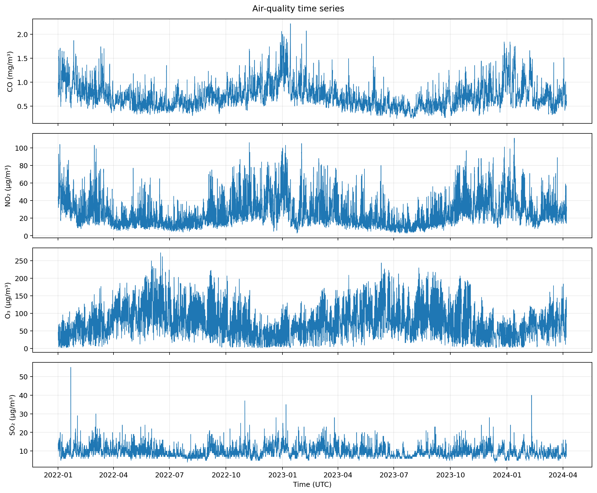
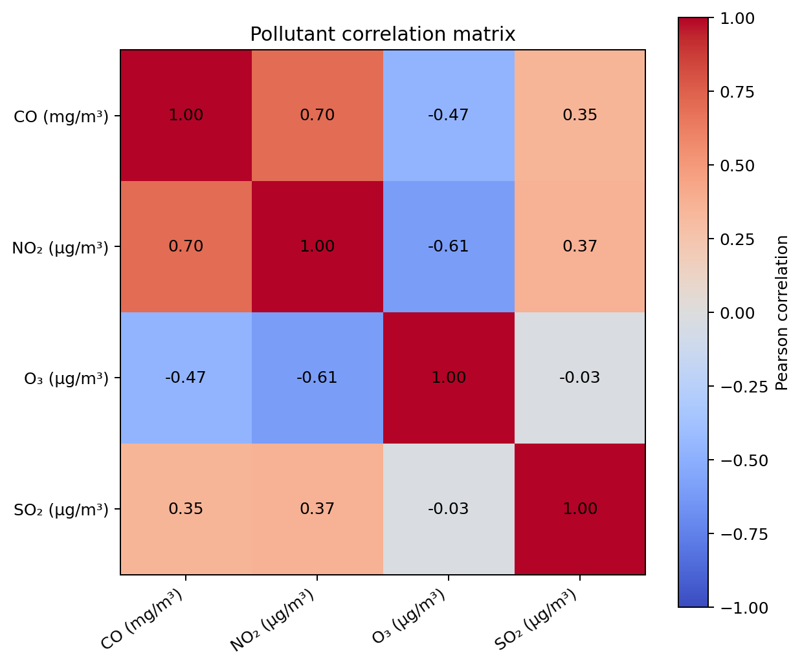
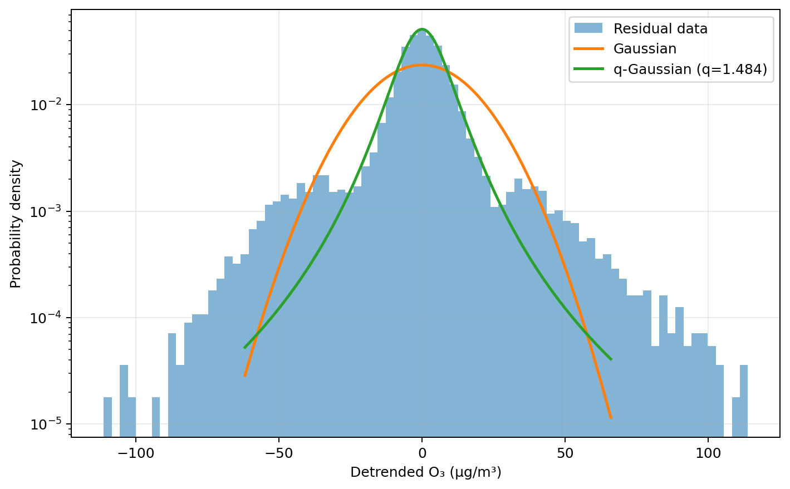

# Air Quality Time-Series Analysis Toolkit

A reproducible Python project for exploratory analysis, detrending, fluctuation analysis, and superstatistical diagnostics of hourly air-quality time series.

The repository includes cleaned demonstration data from Xuzhou for 2022, 2023, and the available portion of 2024. **The original data source is not verified, so the included data is for software demonstration only.**

## Features

- validates and standardizes timestamped pollutant data;
- reconstructs a regular hourly time grid;
- interpolates only bounded missing intervals;
- generates descriptive statistics and correlation analysis;
- performs robust STL detrending;
- compares residuals with Gaussian and q-Gaussian curves;
- estimates a characteristic kurtosis time scale;
- compares positive beta distributions using AIC and KS statistics;
- writes all tables and figures to a predictable results directory;
- includes automated tests and GitHub Actions.

## Example outputs







The figures above are generated from the included demonstration data. They are examples of software output, not official air-quality conclusions.

## Repository structure

```text
.
├── data/
│   ├── raw/                 # Clean yearly demonstration files
│   └── processed/           # Combined data and cleaning summary
├── docs/                    # Data, method, and migration notes
├── src/ts_analysis/         # Reusable analysis package
├── tests/                   # Automated tests
├── results/                 # Generated locally; ignored by Git
├── config.example.json
├── pyproject.toml
├── requirements.txt
└── run_analysis.py
```

## Quick start

Python 3.10 or newer is recommended.

```bash
python -m venv .venv
source .venv/bin/activate       # macOS/Linux
# .venv\Scripts\activate      # Windows PowerShell
python -m pip install --upgrade pip
pip install -r requirements.txt
```

Run the included demonstration:

```bash
python run_analysis.py --config config.example.json
```

The generated tables and PNG figures will be written to `results/`.

You can also install the package in editable mode:

```bash
pip install -e .
air-ts-analysis --config config.example.json
```

## Use another dataset

Prepare a CSV using the schema in [`docs/DATA.md`](docs/DATA.md), then run:

```bash
python run_analysis.py \
  --input path/to/your_data.csv \
  --output results/my_analysis \
  --seasonal-period 24 \
  --weekly-start 2024-01-01
```

## Reproducibility and interpretation

The pipeline is deterministic for a fixed input file and configuration. Missing values, interpolation, detrending, and fitted distributions are explicitly exported for inspection. The outputs are exploratory and should not be interpreted as causal findings or official air-quality assessments.

## Tests

```bash
pip install -r requirements-dev.txt
pytest -q
```

## Reference

The original project was inspired by research on superstatistical fluctuations in environmental time series:

> *Fluctuations of water quality time series in rivers follow superstatistics*, iScience, 2021.

See [`docs/METHODS.md`](docs/METHODS.md) for the implemented analysis steps and [`docs/MIGRATION.md`](docs/MIGRATION.md) for the repository cleanup decisions.
